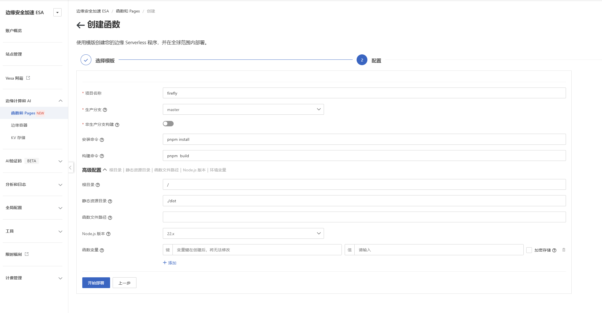

# 部署前提
* 一个开通了ESA的阿里云账号
* Github账号
> 阿里云边缘安全加速 ESA（Edge Security Acceleration），是一款将网络加速与安全防护深度融合的全球化服务。  
> 一般来说免费版本已经足够正常使用了，自行开通免费版。
# 部署步骤

1. [Fork](https://github.com/CuteLeaf/Firefly/fork) Github仓库
2. 登录 阿里云 ESA 控制台
3. 进入 Pages 功能，点击 创建项目，[一键直达](https://esa.console.aliyun.com/edge/pages/creation)
4. 选择 从 Git 仓库导入，连接刚刚Github Fork的仓库
    * 配置构建设置：
    * 安装命令: `pnpm install`
    * 构建命令: `pnpm build`
    * 根目录: `/`
    * 静态资源目录: `./dist`
    * Node.js 版本: `22.xx`        
5. 点击 `开始部署`

:::TIP
原作者也提供了部署教程可以点击 [跳转](https://docs-firefly.cuteleaf.cn/zh/guide/deploy.html#%E9%98%BF%E9%87%8C%E4%BA%91-esa)
:::

# 使用
> 现在你应该成功部署Firefly，可以先访问测试域名查看是否正常，然后配置自己的域名就可以使用了
* `修改Firefly        待补充...`
* `评论系统自部署      待补充...`
* `音乐meting-api     待补充...`
