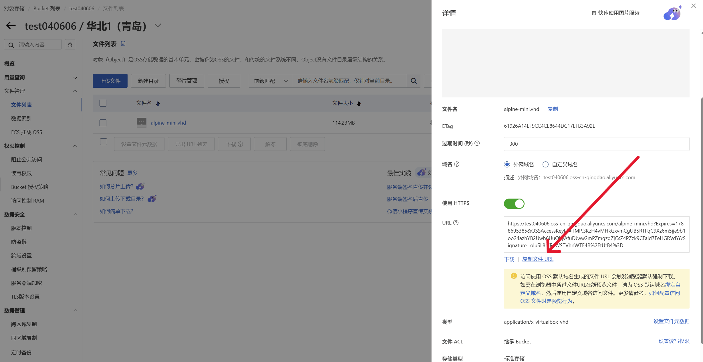
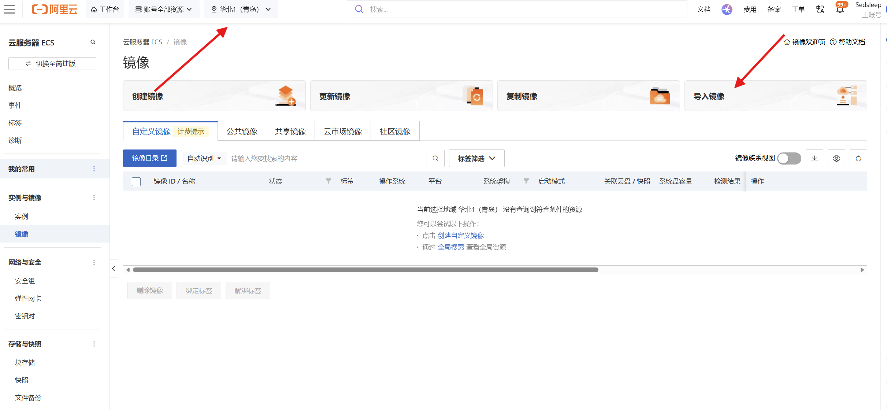
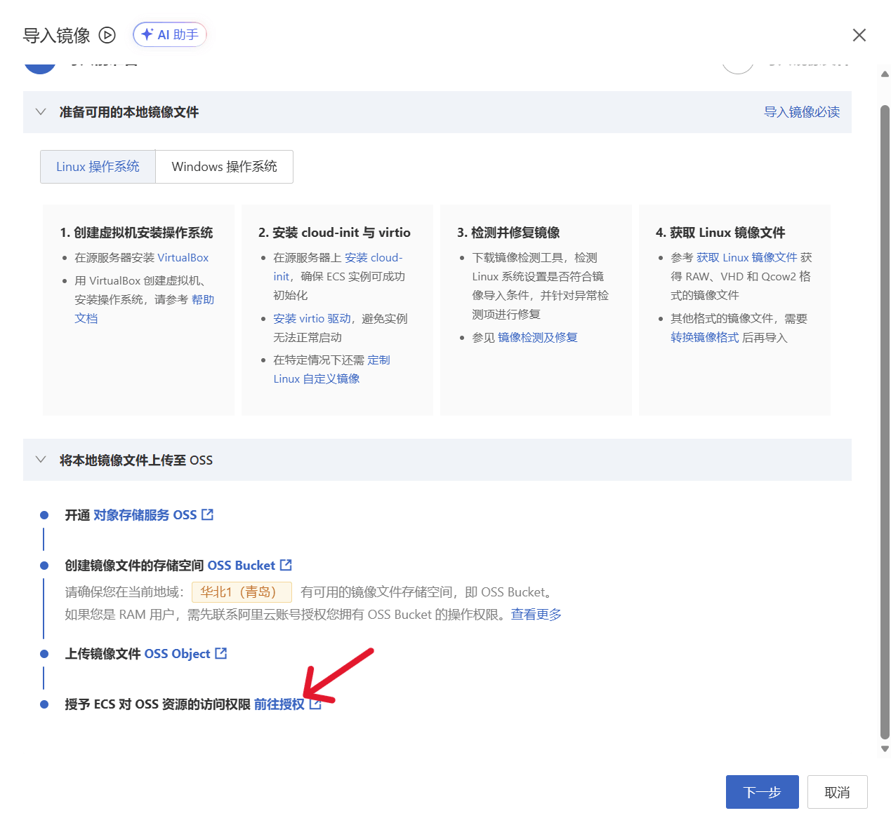
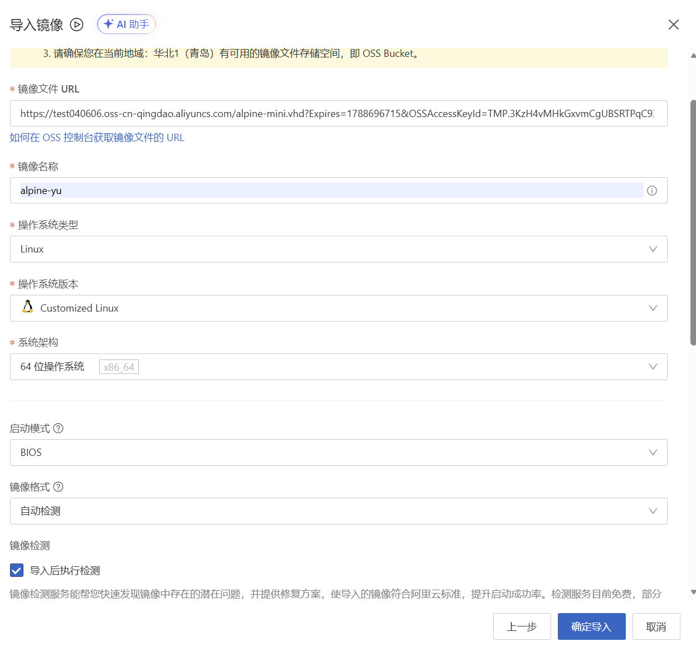
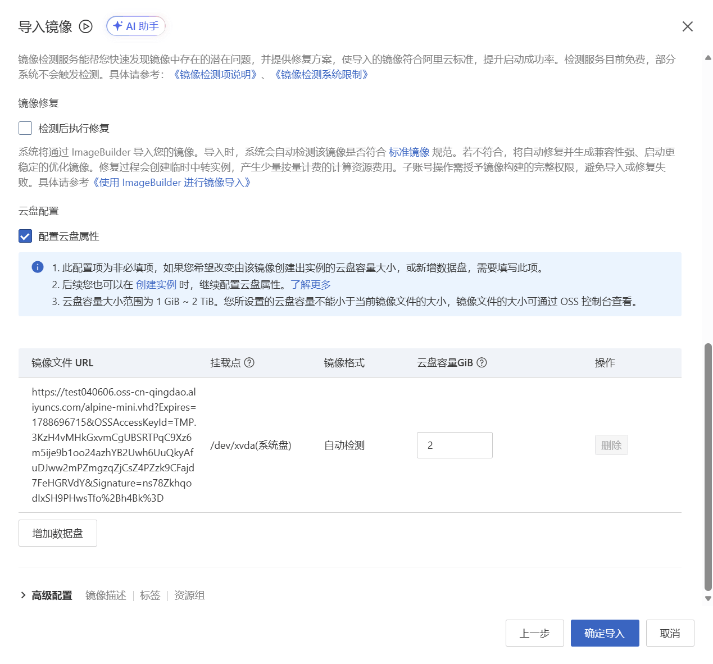
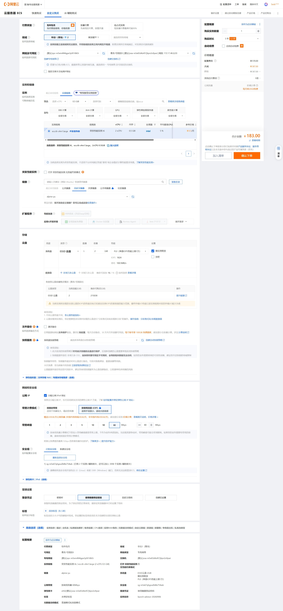
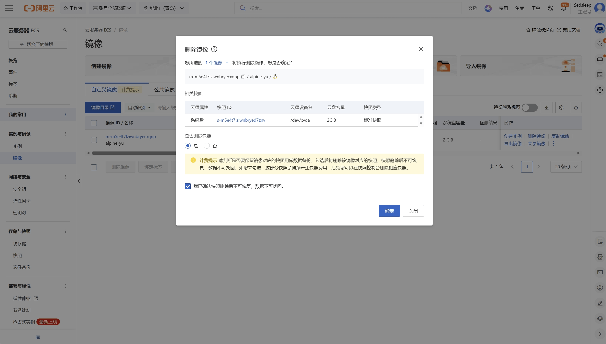
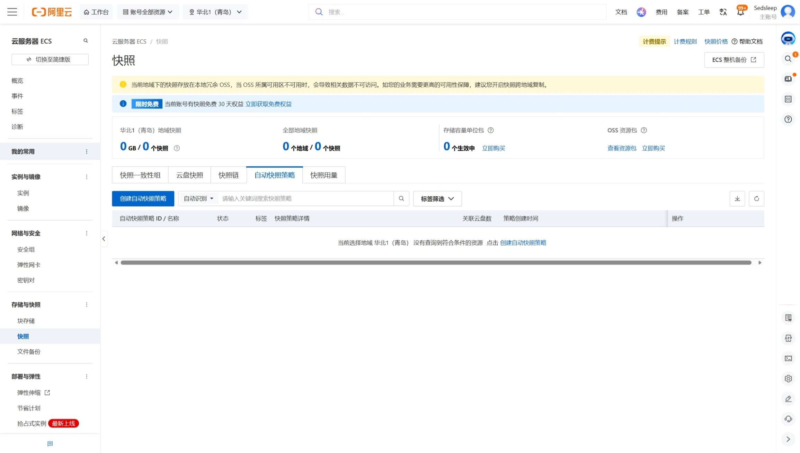

# 介绍

| 地区 | 类别 | 配置 | 每月流量 | 价格 | 
|:---:|:---:|:---:|:---:|:---:|
| 国内ECS | 包年包月 | **2C** **0.5G** **2GB** | **20GB** | **155.5¥/5年** |
| 国外ECS | 抢占式实例 | **2C** **0.5G** **2GB** | **200GB** | **0.1382¥/天** |

:::note
需要注意的是CDT流量是共享的 并非每台都有220GB    
举例: 国内所有使用CDT的实例共享20GB流量 而国外实例共享200GB        
超出流量使用阶梯计费 **流量<10T**  `0.8¥/GB` 由于配置问题只能使用`alpine-mini`系统    

`155.5¥/5年` 是国内青岛ECS包年包月实例    
其他地域可能更便宜也可能更贵 不过差不太多 可以挑选离自己近的地域   
我个人是用作`frp`，`Komari`，`danmu-api`   
   
`0.1382¥/天` 是新加坡ECS抢占式实例的价格 而且是随时可能变化的 不过差不太多可以自己算一下 
国外ECS抢占式实例 人多会被停机 有条件包年包月五年比国内ECS贵一倍      
我使用的是新加坡的ECS 目前一个月1-2次 其他热门地区可能更加频繁      
目前可以用作 :spoiler[**不可言说的神秘力量**]！`hubproxy` (Github,Docker加速)       
只适合轻量使用⚠️请自行考虑是否使用！！！
:::
# 准备
* 略懂linux命令
* 阿里云账号
* alpine-mini镜像
    > 镜像来自于网络，[点击下载](https://hihh.lanzouw.com/iS5Bl46wazcf) **下载为zip, 需要解压得到.vhd**  
    > ssh：`22`     
    > user：`root`    
    > password：`luminous`
# 开始
## 1.制作自定义镜像
1. 打开[OSS控制台](https://oss.console.aliyun.com/bucket),  选择想要的地域创建 **Bucket**, 我这里使用的是青岛的存储桶
2. 上传 **alpine-mini.vhd** 镜像并 **复制镜像URL地址** 
        
:::TIP
URL地址默认是300s过期可以改久一点   
导入镜像时提示没有找到镜像可以重新获取一次
:::
1. 导入镜像
   1. 打开[ECS镜像控制台](https://ecs.console.aliyun.com/image/region/), 选择OSS所在的地域, 点击`导入镜像`
   
   2. 第一次使用需要进行**授权**
   
   3. 填写相关配置
      * 前面保存的`URL地址` **提示没有找到镜像检查地域是否和OSS一致,也可能是过期了重新获取一次**
      * 操作系统类型: `Linux`
      * 操作系统版本: `Customized Linux`
      * 系统架构: `64位操作系统`
      * 云盘属性: `勾选☑️, 并配置为2GB`
      * 其他默认
     
    
   4. 现在你应该已经导入完成所选地域的镜像了
## 2.购买ECS实例
### **新用户领取8.5折优惠卷** [点击领取](https://www.aliyun.com/minisite/goods?userCode=p2a77r0g)     

> 接下来进行ECS购买 [点击前往](https://ecs-buy.aliyun.com/ecs#/custom/prepay/)     
> 下面是我的购买配置
> 
:::TIP
温馨提示你可以在后续转化为**弹性ip** 绑定**弹性公网共享带宽**可以获得更高的带宽   
共享带宽是`2000mbps`    
这里由于国内ECS只有20GB免费流量我就直接使用CDT的80mbps了 
:::

# 后续操作 ! ! !
## 上岸第一步是忘本, 购买服务器也是, 删除以下资源以防额外扣费
1. 删除
   * **删除自定义镜像**
    >  如果你不在该区域创建新机器可以删除 [前往删除](https://ecs.console.aliyun.com/image/region/)
      
   * **删除快照**
    >  `云盘快照`和`自动快照策略`都可以删除 [前往删除](https://ecs.console.aliyun.com/autoSnapshotPolicy/region)
      
   * **OSS存储桶删除**
    > 这个完全没用, 删掉 [前往储存桶](https://oss.console.aliyun.com/bucket)
    > 找到你创建的存储桶, 删掉桶内文件, 再删除桶
## 配置机器
### SSH连接
下面是ssh连接信息
> ssh-port：`22`     
> user：`root`    
> password：`luminous`
> 我使用的ssh连接工具是 **xterminal** 一款美观的ssh工具, [点击前往官网](https://www.xterminal.cn/)  
> 

### 一键配置脚本
可以使用我的一键脚本包含 `扩容` `ntp` `ssh` `docker` `流量监控通知`    
**已经多次测试 完全没毛 放心使用**
```
# 1. 下载脚本到当前目录，赋予执行权限
wget -O alpine.sh xyu.homes/sh/alpine.sh && chmod +x alpine.sh
```
``` 
# 2.执行
./alpine.sh
``` 
按顺序依次执行, 再次运行输入 `./alpine.sh` 即可, 下面是示例
```
========================================
  Alpine Toolbox - 多功能管理
========================================

  1) 磁盘扩容工具 (分区调整与文件系统扩展)
  2) 设置时区与时间同步 (chrony + NTP)
  3) 修复 SSH 配置 (允许端口转发)
  4) 安装 Docker 及配置镜像加速器
  5) 一键执行 2→3→4 (系统初始化全套)
  6) 部署流量监控与告警 (企业微信通知)
  7) 查看系统状态 (时间/分区/Docker/流量)
  0) 退出

请选择 [0-7]:
```
:::warning
1)  磁盘扩容是必要的, 不然空间会不足        
2)  设置时区也是必要的, 不然流量监控的时间会对不上    
3)  修复SSH是可选的, 如果你可以正常SSH选和不选都行    
4)  安装Alpine原生Docker, 这个也是可选的看你用不用的上需要注意的是无法运行太大的项目, 配置不支持    
5)  一键执行2-3-4, 如果你使用Docker可以选择这个, 最大的好处是可以少点几下   
6)  部署监控, 这个非常有必要, 防止流量用超额外付费, 可以设置自动关机和企业微信机器人通知, 下面会介绍如何配置  
7)  查看系统状态
:::
#### 磁盘扩容
   > 1. 运行脚本
   > ```
   > alpine.sh
   > ```
   > 2. 输入 `1` 会进入
   > ```
   > ========================================
   >   磁盘扩容工具
   > ========================================
   > 
   >   1) 修改分区表（扩容分区，需重启）
   >   2) 扩展文件系统（重启后手动执行）
   >   3) 查看分区详细信息
   >   0) 返回主菜单
   > 
   > 请选择 [0-3]:
   > ```
   > 3. 输入 `1` 跟着步骤走会重启一次服务器, 大概十几秒就会重连    
   > 4. 重启后还是运行脚本`./alpine.sh` 再次输入 `1` 回到磁盘扩容工具, 然后输入 `2` 自动扩展文件系统    
   如下就成功了  
> ```
> ========================================
>   磁盘扩容工具
> ========================================
> 
>   1) 修改分区表（扩容分区，需重启）
>   2) 扩展文件系统（重启后手动执行）
>   3) 查看分区详细信息
>   0) 返回主菜单
> 
> 请选择 [0-3]: 2
> ========================================
>   扩展文件系统（手动执行）
> ========================================
> [STEP] 检查文件系统...
> /dev/vda2 is mounted.
> [STEP] 执行文件系统扩展...
> resize2fs 1.47.0 (5-Feb-2023)
> The filesystem is already 512000 (4k) blocks long.  Nothing to do!
> 
> [INFO] 文件系统扩展成功！
> 
> 当前磁盘使用情况：
> Filesystem                Size      Used Available Use% Mounted on
> /dev/vda2                 1.9G     62.2M      1.7G   3% /
> 
> 磁盘布局：
> NAME   MAJ:MIN RM  SIZE RO TYPE MOUNTPOINTS
> vda    253:0    0    2G  0 disk 
> ├─vda1 253:1    0 47.7M  0 part /boot
> └─vda2 253:2    0    2G  0 part /
> 
> 按 Enter 键继续...
> ``` 


#### 设置时区, SSH修复
> 运行脚本 `./alpine.sh` 再输入 `2` 即可设置时区    
> 输入 `3` 即可修复SSH
#### 安装Docker和Docker Compose 
> 运行脚本 `,/alpine.sh` 再输入 `4` 即可一键安装Docker和Docker Compose    
> 如果你决定使用**Docker** 建议直接输入 `5` 初始化
#### 配置流量监控通知
> 这个就是重中之重了, 不想收到天价账单一定要配置
> 1. 获取企业微信机器人 `(可选)` 不设置也没关系, 主要是自动关机        
   > 自行获取机器人 **webhook地址**     
   > 格式为 `https://qyapi.weixin.qq.com/cgi-bin/webhook/send?key=xxx`   
>  2. 执行脚本 `./alpine.sh` 输入 `6` 按提示输入即可    
>     国内ECS流量是 **20GB** , 国外ECS流量是 **200GB** , 示例如下:
> ```
> ========================================
>   Alpine Toolbox - 多功能管理
> ========================================
> 
>   1) 磁盘扩容工具 (分区调整与文件系统扩展)
>   2) 设置时区与时间同步 (chrony + NTP)
>   3) 修复 SSH 配置 (允许端口转发)
>   4) 安装 Docker 及配置镜像加速器
>   5) 一键执行 2→3→4 (系统初始化全套)
>   6) 部署流量监控与告警 (企业微信通知)
>   7) 查看系统状态 (时间/分区/Docker/流量)
>   0) 退出
> 
> 请选择 [0-7]: 7
> ========================================
>   Alpine Toolbox - 多功能管理
> ========================================
> 
>   1) 磁盘扩容工具 (分区调整与文件系统扩展)
>   2) 设置时区与时间同步 (chrony + NTP)
>   3) 修复 SSH 配置 (允许端口转发)
>   4) 安装 Docker 及配置镜像加速器
>   5) 一键执行 2→3→4 (系统初始化全套)
>   6) 部署流量监控与告警 (企业微信通知)
>   7) 查看系统状态 (时间/分区/Docker/流量)
>   0) 退出
> 
> 请选择 [0-7]: 6
> [INFO] 清理旧部署...
> [INFO] 清理完成
> ========================================
>   部署流量监控与告警
> ========================================
> 
> [INFO] 检测到系统包管理器: apk
> [INFO] Cron 服务名: crond
> 
> 检测到默认网络接口为 [eth0]，按回车确认或输入自定义接口: 
> 通知中使用的主机名（默认: alpine）: 
> 企业微信机器人 Webhook URL [https://qyapi.weixin.qq.com/cgi-bin/webhook/send?key=xxx]: 
> 达到多少 GB 时发送通知？[18]: 
> 达到多少 GB 时发送通知并关机？[30]: 
> 
> [INFO] -----------------------------------------
> [INFO] 配置汇总：
>   系统        : apk (crond)
>   主机名     : alpine
>   网络接口   : eth0
>   Webhook URL: https://qyapi.weixin.qq.com/cgi-bin/webhook/send?key=xxx
>   通知阈值   : 18 GB (只通知一次)
>   关机阈值   : 30 GB
> [INFO] -----------------------------------------
> 确认开始部署？[Y/n] y
> [INFO] 创建部署目录...
> [INFO] 部署文件已创建完成
> [INFO] 设置 root 用户级定时任务...
> [INFO] 重启 crond 服务...
>  * Stopping busybox crond ...                                                                                   [ ok ]
>  * Starting busybox crond ...                                                                                   [ ok ]
> [INFO] 设置 crond 开机自启...
>  * rc-update: crond already installed in runlevel `default'; skipping
> [INFO] 定时任务设置完成
> [INFO] 便捷工具已创建: traffic
> 
> [INFO] 开始部署测试...
> [INFO] ✓ 网络接口检测正常 (当前发送字节: 444774)
> [INFO] 发送测试消息...
> [WARN] ✗ 企业微信通知测试失败，请检查 Webhook URL
> [INFO] 执行首次流量采集...
> [INFO] ✓ 流量监测脚本执行成功
> 
> [INFO] =========================================
> [INFO]           🎉 部署完成！
> [INFO] =========================================
> 
> 📌 工作目录：/opt/traffic-monitor
> 🖥️  通知主机名：alpine
> 📦 系统信息：apk (crond)
> 
> 📋 定时任务（root 用户级 crontab）：
>   • 流量监测：每分钟执行一次
>   • 流量日报：每天 22:00 发送
>   • 流量重置：每月 1 日 00:00 执行
> 
> 🔧 常用命令：
>   • 查看流量状态：traffic
>   • 手动执行监测：sh /opt/traffic-monitor/monitor.sh
>   • 查看当前 crontab：crontab -l
> 
> 📁 日志文件：
>   • 错误日志：/opt/traffic-monitor/error.log
>   • 通知日志：/opt/traffic-monitor/notify.log
>   • 运行计数：/root/cron.log
> 
> [INFO] 等待 1-2 分钟后，执行 'traffic' 查看状态
> 
> 按 Enter 键继续...
> ```

# 结尾
:::TIP
> 本教程参考 **Eianun** 的博客教程进行优化 [点击前往Eianun's Blog](https://blog.020915.xyz/archives/aliyun)   
> 
> 同时还有 **Eianun** 的视频教程一并奉上 [点击前往bilibili](https://b23.tv/I4dklQs)
:::
<iframe 
  width="100%" 
  height="468" 
  src="https://player.bilibili.com/player.html?bvid=BV1fojq62EWH&no_related=1&danmaku=0" 
  title="Bilibili video player" 
  frameborder="0" 
  allowfullscreen>
</iframe>
